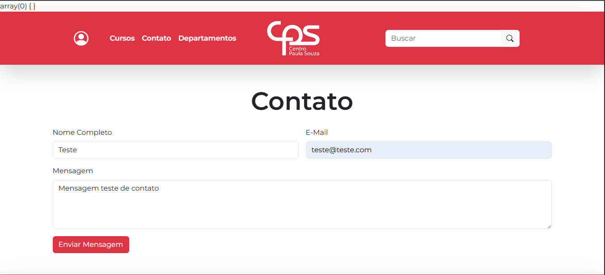
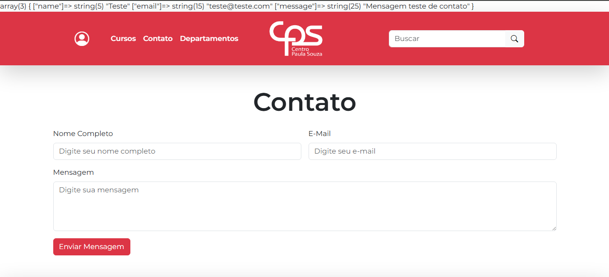

<p align="center">
    
</p>

<h1 align="center">Site da Etec Zona Leste</h1>

### ℹ Sobre o Projeto
Esse é um modelo de site para a instituição **Etec Zona Leste**, com uso do PHP como linguagem de programação e o framework Laravel 12

> Para maiores detalhes sobre o Laravel, acesse a [documentação oficial](https://laravel.com/)

## 💻 Requisitos Mínimos

Verifique se você atende aos requisitos antes de instalar o projeto:
- Sistema Operacional: `Windows 10 ou 11`
- Conexão à Internet: `Sim`
- Armazenamento: mínimo de `2GB` disponíveis
- Gerenciamento do Banco de Dados e Servidor Local: `XAMPP 8.2`

## 🚀 Instalação

Siga os passos abaixo para instalar de forma correta:

1. Baixe o arquivo ZIP desta branch ou clone o repositório em sua máquina:
```
git clone https://github.com/ferreiraluizga/etec_website.git
```

2. Abra o projeto no terminal (IDE ou prompt de comando), execute os seguintes comandos:
```
composer global require laravel/installer
composer install
npm install
```

3. Configure o banco de dados abrindo o `PHPMyAdmin` e criando o banco de dados `etec_website`

4. De volta ao projeto, copie o arquivo `.env_example` e renomeie para `.env`

5. Rode o comando `php artisan key:generate` e em seguida `composer run dev`

6. Por fim, abra o endereço `localhost:8000` no seu navegador

Após esses passos concluídos, a aplicação está pronta para uso
> Para que a aplicação funcione corretamente, é necessário manter os serviços `Apache` e `MySql` do XAMPP ativos

> [!NOTE]
> Para registrar um novo usuário acesse a rota `localhost:8000/register`

## Atividade: Formulário

